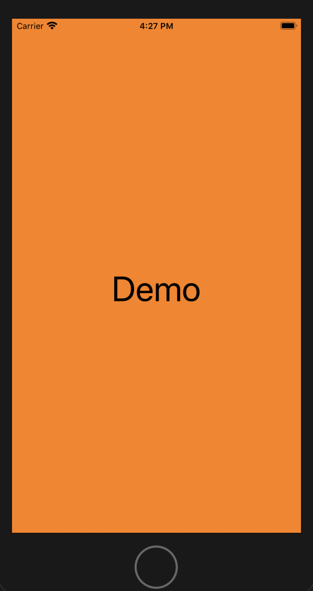

# MyLibrary

[](https://travis-ci.org/myan0020/MyLibrary)
[](https://cocoapods.org/pods/MyLibrary)
[](https://cocoapods.org/pods/MyLibrary)
[](https://cocoapods.org/pods/MyLibrary)
## Screen Shot



## Example

To run the example project, clone the repo, and run `pod install` from the Example directory first.

## Requirements

You'd better to use Xcode 11 and iOS 13.
## Installation

MyLibrary is available through [CocoaPods](https://cocoapods.org). 
To install
it, simply add the following line to your Podfile:

```ruby
pod 'MyLibrary'
```

## Author

myan0020, 843670891@qq.com \newline
If you have any questions, please feel free to ask me by the email above. I am always glade to help or learn.

## License

MyLibrary is available under the MIT license. See the LICENSE file for more info.
